# ✈️ FlyMarket

A native iOS application developed as part of Immfly's Mobile Engineering technical challenge. It showcases a modern SwiftUI architecture, clean state management, and a smooth shopping & payment flow inspired by the in-flight experience.

<p align="center">
  
  
  
  
</p>

## 📋 Table of Contents

* [Features](#-features)
* [Tech Stack](#-tech-stack)
* [Installation](#-installation)
* [Project Structure](#-project-structure)
* [User Flow](#-user-flow)
* [Testing](#-testing)
* [Contributing](#-contributing)

## ✨ Features

* 🎨 **Modern SwiftUI** - Fully built using a declarative UI approach
* 🏗️ **Clean Architecture** - Modular state management with MVVM pattern
* 🛒 **Complete Shopping Flow** - Browse products, add to cart, checkout, and pay
* ✈️ **In-Flight Experience** - Inspired by real airline shopping interfaces
* ✅ **Fully Tested** - Comprehensive unit and UI tests included

## 🛠️ Tech Stack

| Category | Technology |
|----------|-----------|
| **Language** | Swift |
| **UI Framework** | SwiftUI |
| **Platform** | iOS |
| **Architecture** | MVVM / Clean Architecture |
| **Testing** | XCTest (Unit & UI Tests) |

## 📦 Installation

1. Clone the repository:

```bash
git clone https://github.com/Arnau-RR/FlyMarket.git
```

2. Open `FlyMarket.xcodeproj` in Xcode.
3. Choose your simulator or device.
4. Build and run the project.
5. *(Optional)* Resolve any dependencies if using Swift Package Manager or similar tools.

## Project Structure

```
FlyMarket/
├── FlyMarket/              # Main application source code
├── FlyMarketTests/         # Unit tests
├── FlyMarketUITests/       # UI tests for the main flows
├── FlyMarket.xcodeproj     # Xcode project file
└── .gitignore              # Ignored files configuration
```

## 🚀 User Flow

```mermaid
graph LR
    A[🏠 Launch App] --> B[🛍️ Browse Products]
    B --> C[🛒 Add to Cart]
    C --> D[💳 Checkout]
    D --> E[✅ Payment]
    E --> F[📋 Order Confirmation]
```



1. **Launch** - App displays the product catalog
2. **Browse** - User explores available in-flight items
3. **Select** - Products are added to the shopping cart
4. **Checkout** - User proceeds to payment
5. **Confirm** - Order summary and confirmation displayed

*This experience mirrors real in-flight shopping adapted to a mobile interface.*

## 🧪 Testing

* Unit tests validating business logic are located in `FlyMarketTests/`.
* UI tests verifying the main in-app navigation and purchase flow are in `FlyMarketUITests/`.
* Run all tests in Xcode via **Product → Test** or using `⌘ U`.

## 🤝 Contributing

Contributions are welcome! Here's how you can help:

1. **Fork** the repository
2. **Create** a feature branch
   ```bash
   git checkout -b feature/amazing-feature
   ```
3. **Commit** your changes
   ```bash
   git commit -m 'Add some amazing feature'
   ```
4. **Push** to the branch
   ```bash
   git push origin feature/amazing-feature
   ```
5. **Open** a Pull Request

Please ensure:
- ✅ Code follows Swift style guidelines
- ✅ All tests pass
- ✅ New features include tests

---

<p align="center">
  Made with ❤️ for Immfly's Mobile Engineering Challenge
</p>

<p align="center">
  <a href="https://github.com/Arnau-RR/FlyMarket/issues">Report Bug</a>
  ·
  <a href="https://github.com/Arnau-RR/FlyMarket/issues">Request Feature</a>
</p>
